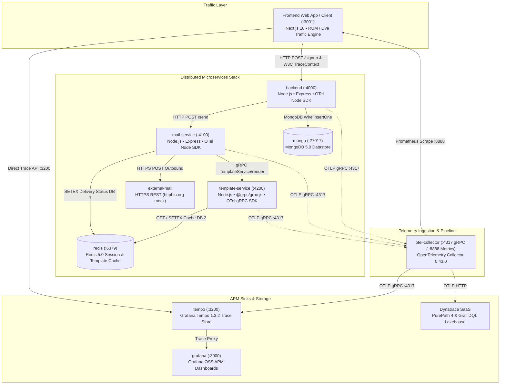

# OpenTelemetry & Dynatrace Observability Control Center

[](https://opentelemetry.io)
[](https://www.dynatrace.com)
[](https://nextjs.org)
[](https://www.docker.com)
[](https://grafana.com/oss/tempo/)
[](https://opensource.org/licenses/Apache-2.0)

> **Enterprise-grade distributed tracing and APM observability platform showcasing hybrid OpenTelemetry and Dynatrace PurePath monitoring across polyglot microservices (Node.js, Express, gRPC, Redis, MongoDB, External SaaS).**

- **Author**: **[Krishna Baviskar](https://github.com/krishna-baviskar)**
- **GitHub Repository**: [https://github.com/krishna-baviskar/otel](https://github.com/krishna-baviskar/otel)

---

## 🌟 Executive Overview

Modern cloud-native systems require end-to-end observability across heterogeneous runtimes, network boundaries, and database drivers. This repository provides a complete, production-grade observability platform combining:

1. **Vendor-Neutral OpenTelemetry Instrumentation**: Native Node.js SDK instrumentation propagating W3C `traceparent` headers across HTTP/REST, gRPC, MongoDB Wire protocol, and Redis TCP.
2. **OpenTelemetry Collector Ingestion Pipeline**: Ingests OTLP traces (`:4317` gRPC), executes memory-limiting and batching processors, and dual-exports to local storage (Grafana Tempo) and enterprise APM (Dynatrace SaaS).
3. **Observability Control Center UI (`/frontend`)**: A Next.js 16 App Router dark-mode console featuring:
   - **Distributed Topology Map**: Real-time 8-node microservice dependency graph with animated SVG packet streams.
   - **Live Traces Explorer & Gantt Flame Graph**: 30-span distributed trace waterfalls directly parsed from Grafana Tempo with sub-millisecond precision.
   - **Real-Time Traffic Engine**: Automated background traffic generator and on-demand transaction dispatchers.
   - **Correlated Logs Stream**: Instant cross-service log correlation keyed by W3C `traceId`.
   - **Dynatrace Query Language (DQL) Workspace**: Interactive Grail queries with live table and JSON views.
   - **Davis® AI Incident Simulation**: Realistic root-cause analysis distinguishing causal problems from downstream symptoms.

---

## 🏛️ System Architecture



---

## 🚀 The 30-Span Distributed Transaction Lifecycle

When a user registers or triggers a request, a single distributed transaction traverses all microservices within a unified W3C Trace Context:

```
[Client / Browser]
       │
       ▼ (1) HTTP POST /signup (traceparent: 00-{traceId}-{spanId}-01)
 [backend:4000]
       ├── (2) validate email [Regex internal span]
       ├── (3) backend.users.insertOne [MongoDB Client span :27017]
       ├── (4) sending email [Context wrapper]
       │       ├── (5) building the payload [Internal span]
       │       └── (6) calling mail-service [HTTP POST client span]
       │                    │
       │                    ▼ (7) Injected W3C traceparent header
       │             [mail-service:4100]
       │                    ├── (8) extracting variables
       │                    ├── (9) render template [Internal wrapper]
       │                    │       └── (10) grpc.TemplateService/render [gRPC Client]
       │                    │                    │
       │                    │                    ▼ (11) gRPC Metadata propagation
       │                    │             [template-service:4200]
       │                    │                    ├── (12) redis.get [Template Cache Lookup :6379]
       │                    │                    ├── (13) compile template [Handlebars internal]
       │                    │                    └── (14) redis.setex [Cache Save :6379]
       │                    ├── (15) deliver mail [Internal wrapper]
       │                    │       └── (16) HTTPS POST [Client span to httpbin.org]
       │                    └── (17) redis.setex [Record delivery status DB 1]
       ▼
 [otel-collector:4317] ──► [tempo:3200] & [Dynatrace PurePath]
```

---

## 🖥️ Observability Control Center Features

The Next.js 16 frontend (`/frontend`) serves as an enterprise APM operations center:

### 1. Interactive Service Dependency Topology (`/topology`)
- **8-Node Distributed Dependency Map**: Prominently visualizes `Client`, `Backend Service`, `MongoDB`, `Mail Service`, `Template Service (gRPC)`, `Redis Cache`, `External Mail Provider`, and `OpenTelemetry Collector`.
- **Animated SVG Packet Flow**: Directional traffic particles moving between connected nodes using `<animateMotion>` and `<mpath>`.
- **Real-Time Node Telemetry Drawer**: Click any service node to inspect live Throughput (RPM), Average Latency, Network Port, Technology Stack, and a one-click button to view all associated traces.
- **⚡ Instant Real Request Button**: Trigger real distributed transactions directly from the topology toolbar with instant visual feedback.

### 2. Live Traces Explorer & Gantt Flame Graph (`/traces`, `/traces/[id]`)
- **Real-Time Polling**: Auto-refreshes every 3.5 seconds with live glowing indicators.
- **On-Demand Transaction Dispatch Bar**:
  - `⚡ POST /signup (30 Spans)`: Fires real request through all 6 microservices.
  - `⚠️ Validation Error (400)`: Tests validation failures producing OpenTelemetry `ERROR` status spans.
  - `🔍 GET /users (MongoDB)`: Queries the MongoDB user collection.
  - `Auto-Traffic Toggle`: Controls background 7-second transaction generation.
- **Gantt Waterfall Flame Graph**:
  - Normalized timeline ruler with sub-millisecond precision.
  - Hierarchical parent/child indentation based on span execution tree.
  - OpenTelemetry Attributes inspector (`http.method`, `db.statement`, `rpc.service`, `net.peer.name`).
  - Span events list with exact timestamps.
  - One-click navigation to correlated logs.

### 3. Real-Time APM Metrics Dashboard (`/metrics`)
- **Throughput by Microservice**: Area charts showing Requests Per Minute (RPM) across services.
- **Latency Percentile Curves**: P50 Median, P95, and P99 Tail Latency tracking.
- **Collector Metrics**: Live Prometheus metrics scraped from `http://localhost:8888/metrics` (`otelcol_receiver_accepted_spans`, `otelcol_process_uptime`, `otelcol_process_memory_rss`).

### 4. Correlated Logs Explorer (`/logs`)
- Filter by microservice, log level (`INFO`, `WARN`, `ERROR`, `DEBUG`), search text, or specific `traceId`.
- Real-time streaming correlated directly with dispatched distributed transactions.

### 5. Dynatrace Query Language (DQL) Workspace (`/dql`)
- Interactive Grail Data Lakehouse console supporting `fetch spans`, `filter`, `summarize`, `sort`, and `limit`.
- Ready-to-run queries: Top Slow Spans, Service Latency Breakdown, Failed Signups, and OTel Collector Ingestion.

### 6. Davis® AI Root-Cause Engine & Chaos Simulation (`/incidents`, `/demo`)
- Causal problem identification distinguishing between root causes and downstream symptoms.
- Safe chaos injection: Redis latency injection, mail delivery drops, and memory buffer saturation.

---

## ⚡ Quick Start Guide

### Prerequisites
- [Docker](https://docs.docker.com/get-docker/) & Docker Compose v2 (or WSL2 on Windows)
- [Node.js](https://nodejs.org) (v18 or v20+) and `npm`

### Step 1: Clone the Repository
```bash
git clone https://github.com/krishna-baviskar/otel.git
cd otel
```

### Step 2: Launch the Microservices Stack
```bash
docker compose up -d
```
Verify all 8 containers are running:
```bash
docker ps --format "table {{.Names}}\t{{.Status}}\t{{.Ports}}"
```

### Step 3: Launch the Observability Control Center
```bash
cd frontend
npm install
npm run dev
```

Open **[http://localhost:3001](http://localhost:3001)** in your browser.

*(Note: Next.js runs on port `3001` so it does not conflict with Grafana on port `3000`)*.

---

## 🔌 Port Mapping & Service Directory

| Service | Technology | Port | Purpose |
|:---|:---|:---|:---|
| **Control Center UI** | Next.js 16 + Tailwind CSS | `:3001` | Observability Control Center Console |
| **Backend Service** | Node.js Express + OTel SDK | `:4000` | REST API Gateway (`POST /signup`, `GET /users/:email`) |
| **Mail Service** | Node.js Express + OTel SDK | `:4100` | Email coordinator (`POST /send`) |
| **Template Service** | Node.js + `@grpc/grpc-js` | `:4200` | gRPC Email template rendering engine |
| **Redis Cache** | Redis 5.0 | `:6379` | In-memory template cache (DB 2) & delivery status (DB 1) |
| **MongoDB** | MongoDB 5.0 | `:27017` | Persistent user collection datastore (`backend.users`) |
| **OTel Collector** | OpenTelemetry Collector 0.43.0 | `:4317` | OTLP gRPC telemetry receiver |
| **OTel Metrics** | Prometheus Exporter | `:8888` | Collector internal health & span counters |
| **Grafana Tempo** | Grafana Tempo 1.3.2 | `:3200` | High-volume distributed trace block store |
| **Grafana UI** | Grafana OSS 8.3.4 | `:3000` | Trace & APM visualization dashboard |

---

## 🛡️ Data Transparency & Modes

The Control Center clearly badges every metric, trace, and log with its source mode:

- 🟢 **`LIVE`**: Telemetry streaming directly from connected Dynatrace SaaS tenant APIs.
- 🔵 **`LOCAL`**: Real-time telemetry actively captured from local Docker containers (`:8888/metrics`, Tempo `:3200`, Express `:4000`).
- 🟣 **`DEMO`**: Safe simulation mode used when credentials are not configured or offline.

---

## 🧪 Testing Distributed Traces Manually

You can also trigger a real distributed transaction from your terminal:

```bash
# Register a new user (generates 30 spans across all services)
curl -X POST http://localhost:4000/signup \
  -H "Content-Type: application/json" \
  -d '{"name":"Alice","email":"alice@example.com"}'

# Query user document from MongoDB
curl http://localhost:4000/users/alice@example.com
```

Watch the spans appear immediately in the **Traces Explorer** at [http://localhost:3001/traces](http://localhost:3001/traces)!

---

## 👤 Author & Support

- **Author**: **[Krishna Baviskar](https://github.com/krishna-baviskar)**
- **GitHub**: [https://github.com/krishna-baviskar](https://github.com/krishna-baviskar)
- **Repository**: [https://github.com/krishna-baviskar/otel](https://github.com/krishna-baviskar/otel)
- **Issues & Contributions**: [https://github.com/krishna-baviskar/otel/issues](https://github.com/krishna-baviskar/otel/issues)

---

### License
This project is licensed under the Apache 2.0 License - see the [LICENSE](LICENSE) file for details.
