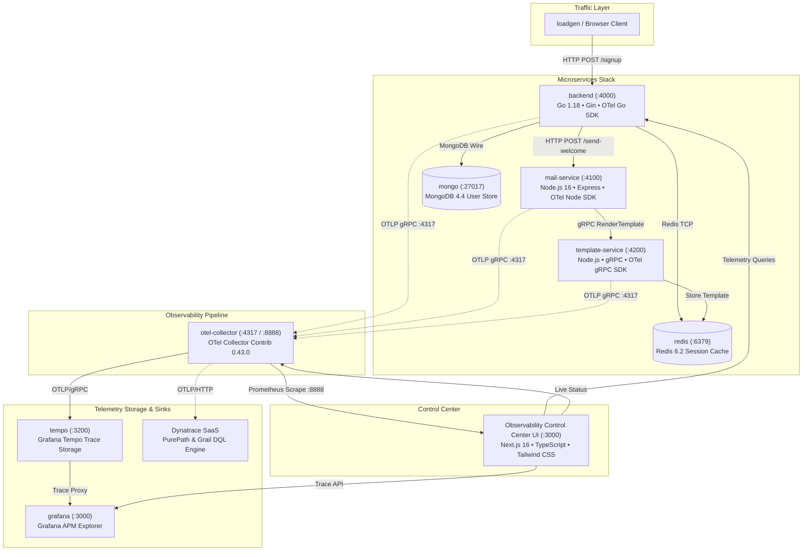

# OpenTelemetry & Dynatrace Observability Control Center

[](https://opentelemetry.io)
[](https://www.dynatrace.com)
[](https://nextjs.org)
[](https://www.docker.com)
[](https://opensource.org/licenses/Apache-2.0)

> **Enterprise-grade distributed tracing and APM observability platform showcasing hybrid OpenTelemetry and Dynatrace PurePath monitoring across polyglot microservices (Go, Node.js, gRPC, Redis, MongoDB).**

- **Author**: [Krishna Baviskar](https://github.com/krishna-baviskar)
- **Repository**: [https://github.com/krishna-baviskar/otel](https://github.com/krishna-baviskar/otel)

---

## 🌟 Executive Overview

Modern distributed architectures require end-to-end observability across heterogeneous runtimes, network boundaries, and database drivers. This repository provides a complete, production-ready observability demonstration combining:

1. **Vendor-Neutral OpenTelemetry Instrumentation**: Native Go and Node.js SDK instrumentation propagating W3C `traceparent` headers across HTTP, gRPC, and database drivers.
2. **OpenTelemetry Collector Ingestion Pipeline**: Ingests OTLP traces (`:4317` gRPC / `:4318` HTTP), executes memory-limiting and batching processors, and dual-exports to local storage (Grafana Tempo) and enterprise APM (Dynatrace SaaS).
3. **Observability Control Center UI (`/frontend`)**: A Next.js 16 dark-mode observability console offering real-time dependency topology mapping, Gantt-style trace flame graphs, APM percentiles (P50/P90/P99), correlated logs, Dynatrace Query Language (DQL) workspace, and Davis® AI root-cause simulation.

---

## 🏛️ System Architecture



---

## 🚀 The 6-Step Distributed Transaction

When a user registers on the platform, a single distributed transaction traverses 5 independent services and data stores within a continuous W3C TraceContext:

| Step | Operation | Source | Target | Protocol | Telemetry Attributes Captured |
|:---:|:---|:---|:---|:---|:---|
| **1** | User Signup Request | Client / Loadgen | `backend:4000` | HTTP/REST | `http.method: POST`, `http.target: /signup`, `http.status_code: 201` |
| **2** | Persist User Profile | `backend:4000` | `mongo:27017` | Mongo Wire | `db.system: mongodb`, `db.name: otel`, `db.operation: insertOne` |
| **3** | Cache Session Key | `backend:4000` | `redis:6379` | Redis TCP | `db.system: redis`, `db.statement: SET token:*` |
| **4** | Welcome Email Dispatch | `backend:4000` | `mail-service:4100` | HTTP/REST | Injected W3C `traceparent` HTTP header |
| **5** | HTML Template Rendering | `mail-service:4100` | `template-service:4200` | gRPC | `rpc.system: grpc`, `rpc.service: TemplateService`, `rpc.method: RenderTemplate` |
| **6** | Telemetry Pipeline Export | All Services | `otel-collector:4317` | OTLP gRPC | Batched spans emitted to Tempo and Dynatrace |

---

## 🖥️ Observability Control Center Features

The Next.js 16 frontend (`/frontend`) serves as the central APM cockpit:

### 1. Interactive Service Dependency Topology (`/topology`)
- **Live SVG Traffic Flow**: Animated particle pulses indicating active HTTP, gRPC, and database connections.
- **Node Health Inspection**: Real-time status badges (Healthy, Degraded, Critical) with click-to-inspect drawers showing latency, error rate, throughput (RPM), and runtime details.

### 2. Distributed Traces & Waterfall Flame Graph (`/traces`, `/traces/[id]`)
- **Gantt-Style Timeline**: Visual waterfall flame graph displaying span offset percentages, duration widths, and nested parent-child hierarchies.
- **Span Inspector**: Interactive inspection panel revealing all OpenTelemetry attributes (`http.status_code`, `db.statement`, `rpc.method`, `net.peer.name`), span events, and error stack traces.
- **One-Click Log Correlation**: Direct navigation from any span or trace to its exact correlated log records.

### 3. Dynatrace Query Language (DQL) Workspace (`/dql`)
- **Grail Data Lakehouse Queries**: Interactive DQL console supporting `fetch spans`, `filter`, `summarize`, `fieldsAdd`, `sort`, and `limit`.
- **Query Presets**: Pre-configured queries for slowest service operations, failed signups, gRPC template latencies, and collector metric ingestion.
- **Dual Presentation**: Live table view and raw JSON export.

### 4. Real-Time APM Metrics Dashboard (`/metrics`)
- **Time-Range Selectors**: 5m, 15m, 30m, 1h, 24h.
- **Charts via Recharts**:
  - Throughput by Microservice (RPM area charts).
  - Latency Percentile Curves (P50 Median, P90, P99 Tail).
  - System Error Rate percentage spikes.
  - OpenTelemetry Collector Prometheus ingestion counter (`otelcol_receiver_accepted_spans`).

### 5. Correlated Logs Explorer (`/logs`)
- Filter by microservice, severity level (`INFO`, `WARN`, `ERROR`, `DEBUG`), or freeform search.
- Automatic filtering by `traceId` query parameter for instant root-cause investigation.
- Expandable JSON payloads showing structured contextual attributes.

### 6. Davis® AI Root-Cause Engine & Chaos Lab (`/incidents`, `/demo`)
- **Causal Problem Identification**: Distinguishes between root causes (e.g., Redis pool exhaustion) and downstream symptoms (e.g., HTTP 500 error spikes on the backend).
- **Safe Chaos Injection**: Interactive simulation controls to trigger and resolve Redis latency slowdowns, mail dispatcher crashes, and collector buffer spikes.
- **Live Transaction Runner**: Step-by-step interactive modal firing real requests to `POST http://localhost:4000/signup`.

### 7. OpenTelemetry Pipeline Hub (`/opentelemetry`)
- Visual architecture breakdown: SDK Sources → OTLP Receivers (`:4317`) → Memory Limiter & Batch Processors → Exporters.
- Active collector configuration viewer reading `services/otel/config-dev.yaml`.

### 8. Dynatrace Hybrid Integration Hub (`/dynatrace`)
- PurePath hybrid monitoring architecture guide.
- Live tenant credentials checker (`DYNATRACE_URL`, `DYNATRACE_API_TOKEN`).
- Fallback indicator clearly distinguishing `LIVE`, `LOCAL`, and `DEMO` data modes.

---

## ⚡ Quick Start Guide

### Prerequisites
- [Docker](https://docs.docker.com/get-docker/) & Docker Compose v2 (or WSL2 Ubuntu on Windows)
- [Node.js](https://nodejs.org) (v18 or v20+) and `npm`

### Step 1: Clone the Repository
```bash
git clone https://github.com/krishna-baviskar/otel.git
cd otel
```

### Step 2: Start the Microservices & Observability Backend
```bash
docker compose up -d
```
Verify all 8 containers are healthy:
```bash
docker ps --format "table {{.Names}}\t{{.Status}}\t{{.Ports}}"
```

### Step 3: Launch the Observability Control Center UI
```bash
cd frontend
npm install
npm run dev
```
Open **[http://localhost:3000](http://localhost:3000)** in your browser.

*(Note: If Grafana is running on port 3000, Next.js will automatically bind to `http://localhost:3001` or you can configure `PORT=3001 npm run dev`)*.

---

## 🔌 Port Mapping & Service Directory

| Service | Technology | Port | Purpose |
|:---|:---|:---|:---|
| **Frontend UI** | Next.js 16 + Tailwind CSS | `:3001` / `:3000` | Observability Control Center console |
| **Backend Service** | Go 1.18 (Gin) | `:4000` | Core API Gateway (Signup, Auth) |
| **Mail Service** | Node.js 16 (Express) | `:4100` | Notification dispatcher |
| **Template Service** | Node.js 16 (@grpc/grpc-js) | `:4200` | High-performance gRPC template engine |
| **Redis** | Redis 6.2-alpine | `:6379` | In-memory session & idempotency cache |
| **MongoDB** | MongoDB 4.4 | `:27017` | Persistent user document database |
| **OTel Collector** | Contrib 0.43.0 | `:4317` (gRPC) / `:4318` (HTTP) | Telemetry ingestion gateway |
| **OTel Prometheus** | Collector Internal Metrics | `:8888` | Pipeline health & span counters |
| **Grafana Tempo** | Tempo 1.3.2 | `:3200` | Distributed trace block store |
| **Grafana UI** | Grafana OSS | `:3000` | Native Grafana trace explorer |

---

## 🛡️ Data Transparency & Modes

The Control Center clearly badges every metric, trace, and log with its true source:

- 🟢 **`LIVE`**: Telemetry streaming directly from connected Dynatrace SaaS tenant APIs.
- 🔵 **`LOCAL`**: Real-time telemetry actively scraped from local Docker Compose containers (`:8888/metrics`, Tempo, Go backend).
- 🟣 **`DEMO`**: Controlled sample data utilized when offline or when credentials are not configured.

---

## 👤 Author & Support

- **Author**: **[Krishna Baviskar](https://github.com/krishna-baviskar)**
- **GitHub**: [https://github.com/krishna-baviskar/otel](https://github.com/krishna-baviskar/otel)
- **Issues & Contributions**: [https://github.com/krishna-baviskar/otel/issues](https://github.com/krishna-baviskar/otel/issues)
